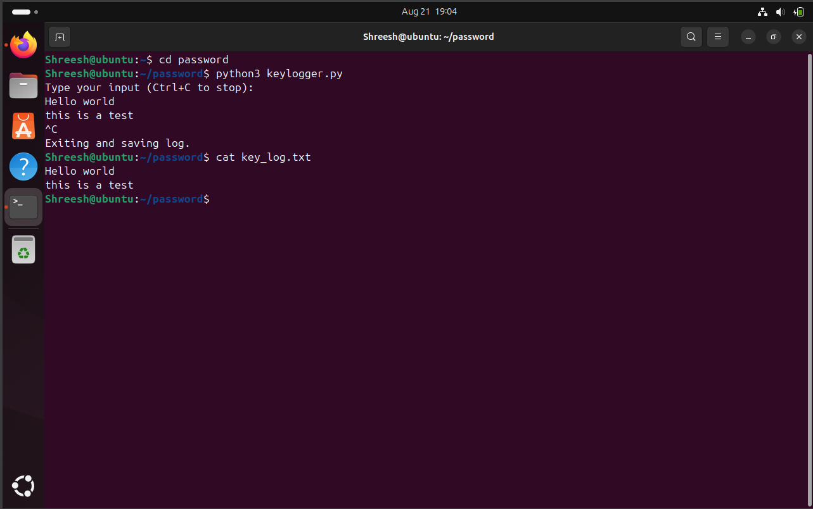

# 📝 Keystroke Input Logger (Python)

A simple Python program that records user input from the terminal and saves it into a log file (`key_log.txt`).

---

## 📂 File Structure

```bash
📦 SCT_CS_4
┣ 📜 keylogger.py     # Main script
┗ 📜 README.md        # Documentation
```

---

## 🎯 Objective

The main objectives of this project are to:
- Show how user input can be continuously captured in Python.
- Demonstrate the use of file handling (append/write mode).
- Log user activity in real-time until the program is stopped.
- Provide a practical example of handling to exit safely.

This project is a **starting point** for understanding input logging, which can later be extended for:
- Command-line journaling
- Debugging tools
- Monitoring utilities

---

## 📝 Description
The program works as follows:
1. Opens (or creates) a log file named `key_log.txt`.
2. Continuously waits for the user to type input in the terminal.
3. Every line entered is appended to the log file.
4. Runs in an infinite loop until the user presses `Ctrl+C`.
5. On interruption, it exits safely and saves all logged data.

This demonstrates **real-time input capture** and **file persistence** in Python.

---

## 🛠️ Technologies Used
- Python 3

---

##  Images / Screenshots  

  

---

